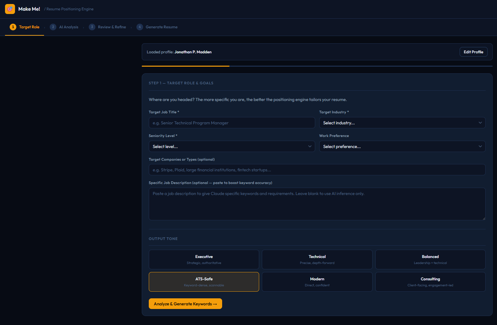

# Make Me! Resume Positioning Engine

**Make Me! Resume Positioning Engine** is an AI-powered career positioning tool that helps candidates turn raw work history into a strategically targeted resume — built for any role, any industry, any level.

Part of the **Make Me!** career tools suite — built by a Senior Technical Program Manager to solve real job search problems with real AI integration.

Most resume tools format. This one interprets.

No installation. No backend. No friction.



---

## What This Demonstrates

- Guided intake design that extracts career signal, not just job history
- AI inference layer that infers role-specific keywords without requiring a job posting
- End-to-end positioning workflow: intake → analysis → refinement → output
- Deliberate architectural tradeoffs for a portable, self-contained tool
- Prompt engineering for structured JSON analysis and semantic HTML output

---

## The Problem

Most job seekers don't struggle with typing their work history. They struggle with:

- Knowing which parts of their background actually matter for a target role
- Sounding strong without sounding fabricated
- Understanding how to position transferable experience
- Identifying what's missing before a recruiter does

Generic resume builders solve the formatting problem. They don't solve the positioning problem.

---

## The Solution

A five-step guided workflow that:

1. Captures target role, industry, seniority, and optional job description
2. Collects structured career history — duties, wins, team size, environment
3. Runs AI analysis to infer keywords, classify experience themes, and surface gaps
4. Lets the user review and refine the keyword set before generating
5. Produces a fully tailored, downloadable resume

The intelligence layer is the differentiator — Claude infers what keywords ATS systems look for, what experience themes matter most, and what language hiring managers use for that specific role and industry. No job posting required.

---

## Design Constraints (Intentional)

- **Single HTML file** — zero dependencies, zero deployment surface, runs in any browser
- **Runtime API key input** — entered by user at runtime, never stored or persisted
- **localStorage persistence** — profile saved after first-time setup, never re-entered
- **Five-step wizard UX** — structured intake prevents the blank page problem

These were deliberate decisions to maximize portability and ease of use. See Known Limitations for the production tradeoffs this implies.

---

## Features

### First-Time Setup
- One-time profile entry: name, contact, full work history, tools, compliance, certifications
- Saved to localStorage — never asked again on return visits
- Edit profile anytime via settings

### Step 1 — Target Role
- Job title, industry, seniority level, work preference
- Optional job description paste to boost keyword precision
- AI inference fills keyword gaps even without a posting

### Step 2 — Career Intake
- Pre-filled from saved profile
- Tone selector: Executive, Technical, Balanced, ATS-Safe, Modern, Consulting

### Step 3 — AI Analysis
- Claude infers keyword sets across four categories: Core Role, Technical, Domain/Compliance, Leadership
- Classifies experience into positioning themes
- Surfaces honest gap analysis with suggestions

### Step 4 — Review & Refine
- Interactive keyword chips — click to remove before generating
- Positioning themes showing how experience maps to the target role
- Gap analysis with actionable suggestions
- **Bullet Rewriter** — paste any weak bullet, get a stronger version instantly

### Step 5 — Generate Resume
- Complete resume with headline, summary, competencies, and rewritten experience bullets
- Keywords incorporated naturally — never stuffed
- Positioning summary and keyword coverage panel
- Download as `.doc` file ready to submit

---

## Architecture

```
┌──────────────────────────────────────────────────┐
│              Browser (Single HTML File)           │
│                                                  │
│  ┌─────────────────────────────────────────┐    │
│  │  First-Time Setup → localStorage Profile │    │
│  └──────────────────┬──────────────────────┘    │
│                     │                            │
│  ┌──────────────────▼──────────────────────┐    │
│  │  5-Step Guided Workflow                  │    │
│  │  Target → Intake → Analysis →           │    │
│  │  Refine → Generate                       │    │
│  └──────────────────┬──────────────────────┘    │
│                     │                            │
│          ┌──────────▼──────────┐                │
│          │   Prompt Engine      │                │
│          │   Analysis / Resume  │                │
│          └──────────┬──────────┘                │
└─────────────────────┼────────────────────────────┘
                      │ HTTPS
                      ▼
             ┌─────────────────┐
             │  Anthropic API   │
             │  claude-sonnet   │
             └─────────────────┘
```

**Two-pass AI approach:**
- **Pass 1 (Analysis):** Returns structured JSON — keywords, positioning themes, gap analysis, headline
- **Pass 2 (Generation):** Returns semantic HTML — complete resume with summary, competencies, rewritten bullets

---

## Setup

1. Clone or download this repo
2. Open `Resume_Positioning_Engine.html` in any modern browser — Chrome recommended
3. Get an [Anthropic API key](https://console.anthropic.com/)
4. Paste your API key in the header — the dot turns green when valid
5. Complete the one-time profile setup
6. Follow the five-step guided flow for each application

**No installation. No build step. No server.**

---

## Known Limitations

- **Client-side API calls** — requests are made directly from the browser. Deliberate prototype decision. In production, calls would be proxied through a backend service.
- **localStorage profile** — saved locally in the browser. Clearing browser data will clear the profile. A production version would support cloud-synced profiles.
- **Output parsing** — JSON extraction uses first/last brace matching, reliable with structured model output but would benefit from schema validation in production.
- **Single-file architecture** — intentional for portability, but a production system would separate concerns into modules.

---

## Tech Stack

- **Vanilla HTML / CSS / JS** — single file, no framework
- **Anthropic Claude API** — `claude-sonnet-4-20250514` via `/v1/messages`
- **No backend. No database. No build tooling.**

---

## Roadmap

**Phase 2 — Multi-Version Output**
Generate Executive, Technical, and ATS-Safe resume versions from one intake session.

**Phase 3 — LinkedIn Summary Generator**
Output a tailored LinkedIn "About" section alongside the resume.

**Phase 4 — Interview Prep Mode**
Generate likely interview questions and talking points based on the resume and target role.

**Phase 5 — Suite Integration**
Feed the positioned resume directly into the Application Engine for job-specific tailoring.

---

## Part of the Make Me! Suite

| Engine | Tool | Purpose |
|--------|------|---------|
| Engine 1 | **Make Me! Resume Positioning Engine** | Build a strategically positioned resume from scratch |
| Engine 2 | **[Make Me! Application Engine](https://github.com/Jon-P-Madden/application-engine)** | Analyze job postings, tailor existing resumes, track applications |

Use Engine 1 to build your positioning. Use Engine 2 to apply it.

---

## Why This Exists

This tool is not a resume formatter.

It demonstrates how to build a workflow around a real, underserved problem: most candidates don't know how to translate raw experience into targeted positioning.

- **Intake design** — structured questions that surface signal, not just data entry
- **AI as interpreter** — Claude used to classify and reframe, not just generate
- **Workflow thinking** — five deliberate steps that mirror how a career strategist works
- **Constraint-driven architecture** — single-file, no-backend, maximum portability

---

## License

MIT — use it, fork it, adapt it.

---

*Built by Jonathan Madden*
*[LinkedIn](https://linkedin.com/in/jonathan-p-madden) · [github.com/Jon-P-Madden](https://github.com/Jon-P-Madden)*
